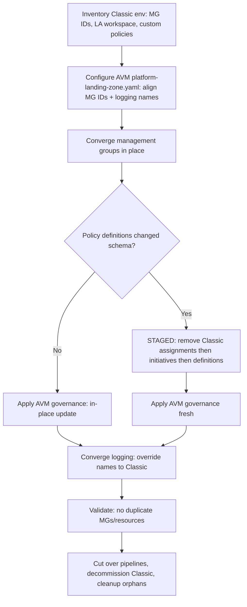

A practical, step-by-step guide for moving an existing **ALZ-Bicep (Classic)** platform to the **Azure Verified Modules (AVM) Bicep accelerator** ([`alz-bicep-accelerator`]()) **without recreating** your live management groups, policies, or logging.

## Overview

ALZ-Bicep (Classic, `Azure/ALZ-Bicep`) is being retired — the Classic starter was removed from the Accelerator on **2026-02-16**, and the repository will be **archived on 2027-02-16** (bug/security/policy fixes only in between). The successor is the **Bicep AVM accelerator**, configured through a single `platform-landing-zone.yaml` and the shared **ALZ Library**.

This guide describes the **supported migration path** and the **one hard blocker** you will hit, with its mitigation.

### What you get from this migration

- Same management-group hierarchy, retained **in place** (no re-parenting, no subscription moves).
- Governance (policy/RBAC) re-based onto the maintained AVM library.
- A modern, config-driven deployment model going forward.

## Who this is for & scope

- **Audience:** platform/landing-zone operators running ALZ-Bicep Classic today.
- **In scope:** management groups, policy (definitions/initiatives/assignments/role assignments), logging. RBAC and subscription placement follow the same pattern.
- **Out of scope (call out separately):** hub/vWAN networking — the same *principles* apply (align names/RGs), but they are not covered in detail here.

## The mental model (read this first)

Two facts make this migration tractable:

1. **Both frameworks are Bicep/ARM — declarative and idempotent, with no state file.** There is nothing to "import." You **converge** the new configuration onto the existing resources and let ARM reconcile.
2. **ARM updates in place only when the resource *name/ID* matches.** If a name differs, ARM **creates a new resource** instead of updating the existing one. So the entire migration comes down to **making the AVM configuration produce the same identifiers your Classic deployment already created.**


**Strategy: in-place brownfield convergence.** Re-point deployment to the AVM accelerator, configured so its identifiers match the existing environment, and let ARM converge. A *parallel build + cutover* is the fallback only when identifiers genuinely cannot be aligned.


## How the two frameworks differ

| Layer | Classic (`ALZ-Bicep`) | AVM accelerator (`alz-bicep-accelerator`) |
|---|---|---|
| MGs & governance | `managementGroups`, `policy`, `roleAssignments`, `customRoleDefinitions` | `templates/core/governance` + ALZ Library |
| Logging | `logging`, `mgDiagSettings` | `templates/core/logging` |
| Networking | `hubNetworking` / `vwanConnectivity` (+ spokes, peerings, DNS) | `templates/networking/hubnetworking` / `virtualwan` |
| Config model | Per-module `.bicepparam` + orchestration | Single `platform-landing-zone.yaml` + ALZ Library |
| Deploy driver | Per-module CLI/pipeline | ALZ PowerShell bootstrap (`Deploy-Accelerator`), ordered `deployment_files` |

### The two naming differences that matter most

1. **Management-group IDs.** Classic uses **nested** IDs (`<prefix>-platform-connectivity`, `<prefix>-landingzones-corp`). AVM defaults to **flat** IDs (`connectivity`, `corp`) and nests only via the *parent* relationship. → You must override each AVM MG ID to the full Classic ID.
2. **Logging resource names.** Classic: `alz-log-analytics`, `alz-logging-mi`, `alz-ama-*-dcr`. AVM default: `law-alz-<loc>`, `mi-alz-<loc>`, `dcr-*-alz-<loc>` (and the RG gets a `-<loc>` suffix). → You must override these names to adopt the existing workspace.

## Prerequisites

- **Tenant-root deployment rights.** The MG layer deploys at tenant scope; you need `Microsoft.Resources/deployments/*` at `/` (or create/align the MGs under an owned parent MG if you don't have root rights).
- Azure CLI + Bicep, and the **ALZ PowerShell bootstrap** (`Deploy-Accelerator`).
- A full **inventory of your Classic environment**: MG IDs, Log Analytics workspace name + RG, custom policy/initiative names, and the identities/DCRs the policies reference.
- A non-production run first (a sandbox or the same environment with `what-if`).

## Migration at a glance



## Step-by-step

### Step 1 — Inventory the existing environment

Record, from the live Classic platform:

- Every **MG ID** in the hierarchy (top/int-root, platform + children, landing zones + children, sandbox, decommissioned).
- The **Log Analytics workspace** name, its **resource group**, the **user-assigned identity**, and the **data collection rules**.
- The **custom policy definitions/initiatives** and **policy assignments** (names + scopes).

### Step 2 — Align identifiers in `platform-landing-zone.yaml`

- **MG IDs (critical):** set **each** `management_group_*_id` to the full Classic ID. Example:

  ```yaml
  management_group_int_root_id: "<prefix>"
  management_group_platform_id: "<prefix>-platform"
  management_group_connectivity_id: "<prefix>-platform-connectivity"
  management_group_identity_id: "<prefix>-platform-identity"
  management_group_management_id: "<prefix>-platform-management"
  management_group_security_id: "<prefix>-platform-security"
  management_group_landing_zones_id: "<prefix>-landingzones"
  management_group_corp_id: "<prefix>-landingzones-corp"
  management_group_online_id: "<prefix>-landingzones-online"
  management_group_sandbox_id: "<prefix>-sandbox"
  management_group_decommissioned_id: "<prefix>-decommissioned"
  ```

  
  A single `management_group_id_prefix` **cannot** reproduce Classic's non-uniform nesting — you must set each ID individually.
  

- **Logging names:** override the AVM workspace/identity/DCR names to your Classic names (`alz-log-analytics`, `alz-logging-mi`, `alz-ama-*-dcr`). Note the AVM logging **RG** name hard-appends `-<loc>`; to adopt a workspace sitting in a Classic RG without that suffix, edit the generated `templates/core/logging` Bicep after bootstrap (the accelerator supports post-bootstrap edits).

### Step 3 — Preview with `what-if`, then converge management groups

Run the governance deployment in `what-if` first. With IDs aligned you should see **in-place Modifies**, not Creates of a new hierarchy. Then apply.


A green `what-if` is **not** a guarantee of a successful apply — see Step 4.


### Step 4 — Converge policy (expect the blocker; use the staged path)

When you apply governance for real, you may hit:

> **`InvalidPolicyParameterUpdate` — "policy parameters cannot be removed during policy update."**

**Cause:** the newer AVM-library version of a custom **policy definition** has **fewer/renamed parameters** than your Classic version, and Azure forbids removing parameters on an in-place definition update. `what-if` reports a clean `Modify` and does **not** catch this.

**Supported mitigation — re-baseline policy in a staged sequence:**

1. Remove the Classic **policy assignments** (all scopes in the hierarchy).
2. Remove the Classic **custom initiatives** (policy set definitions).
3. Remove the Classic **custom policy definitions**.
4. **Apply the AVM governance fresh** — now every policy object is a **Create**, so the parameter-removal rule never triggers.

Because ARM MG deployments are **not atomic**, treat this as **idempotent/re-runnable** and be ready to re-run after a partial failure.

### Step 5 — RBAC / custom role definitions

Same principle: align custom role definition and role assignment names so they update rather than duplicate. If the schema changed, apply the same remove→recreate pattern.

### Step 6 — Logging

Apply the AVM logging with the **overridden names** from Step 2 so it adopts the existing workspace instead of creating `law-alz-<loc>`. If the RG name can't be matched via config (the `-<loc>` suffix), either edit the Bicep or accept the workspace moving RG — decide per environment.

### Step 7 — Cut over deployment tooling

Replace the Classic per-module pipelines with the AVM accelerator bootstrap. **Decommission Classic pipelines only after** the convergence is validated.

## Known issues & mitigations (summary)

| Issue | Cause | Mitigation |
|---|---|---|
| Parallel/duplicate MG hierarchy | AVM flat IDs ≠ Classic nested IDs | Override each `management_group_*_id` to the full Classic ID |
| `InvalidPolicyParameterUpdate` on apply | Policy definition parameters removed between library versions; **`what-if` misses it** | Staged remove (assignments→initiatives→definitions) → apply AVM fresh |
| Duplicate Log Analytics workspace | AVM logging names differ (`law-alz-<loc>` etc.) | Override AVM logging names; edit Bicep for the RG `-<loc>` suffix if needed |
| Orphaned Classic-only policies | AVM apply shows **0 Deletes** — it never removes them | Reconcile/remove deprecated Classic policies post-migration |
| Partial failure mid-apply | ARM MG deployments aren't atomic | Make the runbook idempotent; re-run to remediate |
| Blocked at MG layer | Needs tenant-root deploy rights | Obtain rights, or align MGs under an owned parent MG |

## Validation

After convergence, confirm:

- **No duplicate MGs** — the flat AVM IDs (`alz`, `platform`, `connectivity`, …) must **not** appear; only your existing nested IDs.
- Policy definitions/initiatives/assignments exist at the **expected MGs** (the AVM-library versions).
- The **existing** Log Analytics workspace is the one referenced (not a new `law-alz-<loc>`).

## Rollback

Because there is no state file, rollback = re-deploy the Classic modules (they are still available until archival). Keep the Classic config/pipeline until the AVM convergence is validated in production.

## Post-migration cleanup

- Remove **orphaned policy role assignments** left by deleted Classic policy identities.
- Remove any **Classic-only** definitions/assignments the new library doesn't include but you no longer want.
- Retire Classic pipelines and, eventually, the Classic repo reference.

## Appendix A — Validated results

The migration path above was validated end-to-end (real deployments), Classic **v0.25.6** → AVM accelerator:

| Scenario | Result | Meaning |
|---|---|---|
| Governance, MG IDs **aligned** (what-if) | Modify existing / a few Creates / 0 Delete | In-place convergence |
| Governance, MG IDs **not aligned** (what-if) | All Creates | Full duplicate hierarchy |
| Logging, AVM defaults (what-if) | All Creates | Duplicate logging stack |
| Governance **real apply** (in place) | **Failed** — `InvalidPolicyParameterUpdate` | Definition param removal blocked |
| Staged remove + **re-apply** | **Succeeded** — converged in place, no duplicates | Mitigation proven |

## Appendix B — Reference

- **AVM deploy order** (`.config/ALZ-Powershell.config.json` → `deployment_files`): int-root → landing zones (+corp/online/local) → platform (+connectivity/identity/management/security) → sandbox → decommissioned → RBAC → logging → networking. Each is an `az deployment mg` at the root-parent MG scope, using a `main.bicep` + rendered `main.bicepparam`.
- **Layer mapping:** Classic `managementGroups`/`policy`/`logging` → AVM `templates/core/governance`/`templates/core/logging`; Classic `hubNetworking`/`vwanConnectivity` → AVM `templates/networking/*`.
